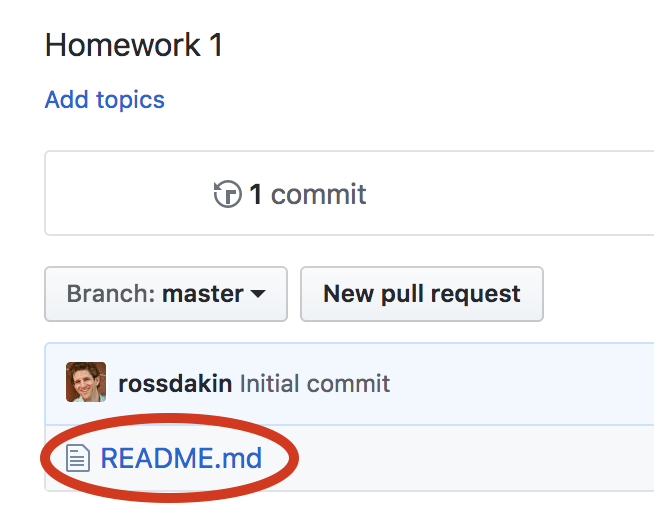
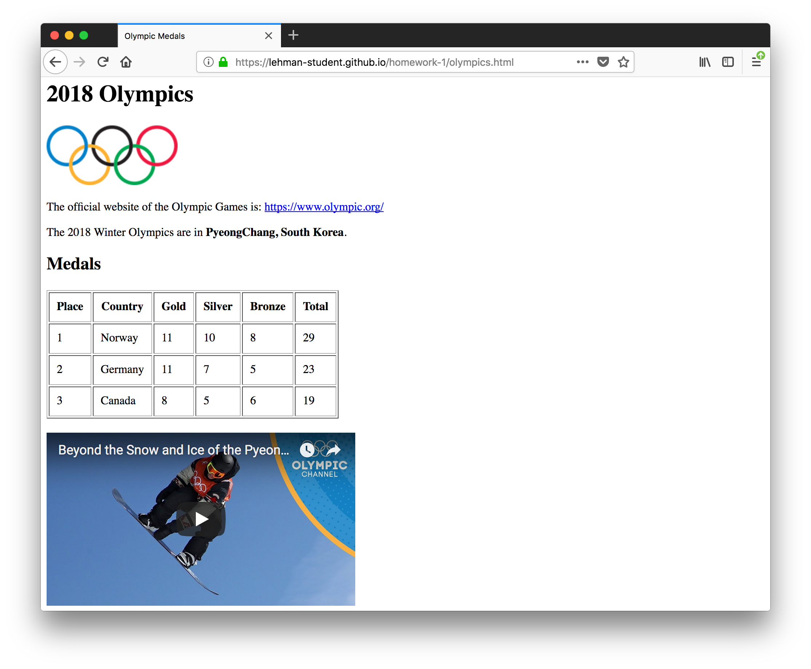

# Homework 1

This homework assignment covers the content that we discussed in class up until and including February 5.
Hello  Vietnam 

## GitHub

We will exlusively use GitHub for all assignments in this class. Therefore (and because it is broadly used in industry), you should familiarize yourself with GitHub and its features.

### 1. Learn about GitHub

Perform this "Hello World" exercise: https://guides.github.com/activities/hello-world/

### 2. Understand Markdown

[Markdown](https://en.wikipedia.org/wiki/Markdown) is a language for simple text formatting. Usually, markdown files end in `.md` (like this file, `README.md`).

You will complete this homework assignment by modifying this Markdown file (`README.md`).

Take a look at these resources to understand Markdown basics:

* https://help.github.com/articles/basic-writing-and-formatting-syntax/
* https://guides.github.com/features/mastering-markdown/
* https://github.com/adam-p/markdown-here/wiki/Markdown-Cheatsheet

### 3. Modify README

Read about the `README.md` file: https://help.github.com/articles/about-readmes/

Now, edit the `README.md` file in this homework repository by clicking the `README.md` file in the list of files:

Then click the pencil icon to edit it:

Next, edit this line to add your name: **Your Name**

Click the "Preview changes" tab to see your changes.

When you are happy with your changes, click the "Commit changes" button at the bottom (optionally entering a commit title and description):

You should now see your name above (instead of "Your Name"). You can also see your change in the repository's commit history.

### 4. LinkedIn profile URL

[LinkedIn](linkedin.com) is a professional networking site used by almost all companies and recruiters. By establishing your professional profile now, to can begin to connect with other classmates and build your professional network.

Please sign up for LinkedIn and share your LinkedIn profile URL here. If you do not wish to be a member of LinkedIn, please write "I decline.":

[My LinkedIn Profile](https://www.linkedin.com/in/.../)

### 5. Setup GitHub Pages

[GitHub Pages](https://pages.github.com/) is a feature of GitHub that lets you serve webpages directly from a GitHub repository.

You will need to do this once for each homework assignment and class project.

Click the "Settings" tab in your repository:

Enable GitHub Pages on the master branch:

After saving, note the public URL of your repository -- you will use this in the "Writing Code" section below:

## The Web

Please edit this file to add your answers to the following questions.

### URLs

#### 5. In the following URL: `https://www.nsnsp.org/commitments?date=2017-12-09`

* What is the scheme/protocol?
the protocols is https

* What is the host?
the host is www.nsnsp.org
* What is the port number?
443
* What is the path
  commitments

* What are the query parameters?
date=2017-12-09
* What is the fragment?
 no it does exist  because theis not #

#### 6. In the following URL: `http://localhost:4000/localhost?`

* What is the scheme/protocol?
  http
* What is the host?
 localhost
* What is the port number?
4000
* What is the path?
admin
* What are the query parameters?
none
* What is the fragment?
none

#### 7. In the following URL: `http://www.lehman.edu/academics/mathematics-computer-science/index.php`

* What is the scheme/protocol?http
http
* What is the host?
www.lehman.edu
* What is the port number?
80
* What is the path?
/academics/mathematics-computer-science/index.php

* What are the query parameters?
none
* What is the fragment?
none

#### 8. In the following URL: `https://en.wikipedia.org/wiki/Greek_alphabet#Glyph_variants`

* What is the scheme/protocol?
https
* What is the host?
en.wikipedia.org
* What is the port number?
443
* What is the path?wiki/Greek_alphabet

* What are the query parameters?
none
* What is the fragment?
#Glyph_variants

### 9. HTTPS

What does the S stand for in HTTPS?
it is encrypted 
Why is HTTPS better than HTTP?

 because it allow security between the user and the server
Should all web pages use HTTPS?
it gives more protection and privasity to your users
yes, today it is easier to implment 

## Webpages

Pleaes ensure you have read chapters 1–9 (except 7) in the [HTML & CSS book](https://isbndb.com/book/9781118008188) or similar information available from MDN here:

* https://developer.mozilla.org/en-US/docs/Web/HTML
* https://developer.mozilla.org/en-US/docs/Web/Tutorials

### 10. What is a webpage?

A webpage  is html document stored in the server that allow murtiple user to  download it their browsers

### 11. Webpage I like

What's one webpage you like? Why?

 duckduckgo.com, it allow me to find infomation fast while allowing privasity .

### 12. Website I don’t like

What's one webpage you like? Why?

 facebook and all the social netweork, This copanies  have paint attetion to privacity and the emengence of  face news  data driven attacks to our deomocracy  

### 13. Resources

Where is a good place to look for information about HTML tags?

www.w3schools.com

### 14. HTML Versions

Which version of HTML are we covering in this class? 

we are  HTML5

What is it's DOCTYPE tag?

we covering html  and we DOCTYPE  is html type yet it define the document stadard being used 
What is XML?

it give struture to a document  while allow you to create your own tag that 

can be specially useful in infomation traferming 

What is XHTML?

 XHTML    was  the chnage done to  htlm4.0 so webpages could be more stataraized.
 
  xHTML evolved into xHTML1.0 wich is the standard used today  in html5 
### 15. HTML

Are web pages ASCII (plain text) files, or compiled (binary) files like an executable program?
no they intepreted. the system look in ordering
Are HTML files interpreted or executed?

 they are interpreted

### 16. Browser versioning

Which versions of Microsoft Internet Explorer support the `<nav>` tag?

9  10 11

### 17. HTML Validity

What is one tool that can tell you if you have written valid HTML?

https://validator.w3.org/ this  validy checker prodivded from ther w3c oganization 

### 18. Accessibility

What does "Accessibility" mean in the context of web development?

Making sure that  create web that accomidate the diferent softwere that people with disability use to acess the web
like voice to text 

What types of people does accessibility concern?

People who sufert from  disabilities  and especially  goverments  that want to make sure that their product
is accessible to people   with disdabilities 

What is one tool you can use to verify the accessibility of your websites?

http://wave.webaim.org/ this free option look into you website, yet there exist organization  that for modical prices could check your web for accesibility

### 19. head / body

What is the `<head>` tag for?

contain metada and linking outside resources it also  help the search engine to indeitfied  the   rellevance of the page

What is the `<body>` tag for?

contain the  content of website 

### 20. Head…

What's the difference between `<head>`, `<header>`, and heading tags?

head refere to mosly  the metadata and other infomation in the  docuemnt and  cannot be  alocateds into body of the document
header mean the tag that you want to allocate  before  h1, h2 ... h6

### 21. Tables

What are all the tags associated with [HTML tables](https://developer.mozilla.org/en-US/docs/Learn/HTML/Tables) (e.g. `<table>`, `<tr>`, etc.)? 
table  theader  tbody tfooter  th tr td

### 22. Non-closing tags

Which tags don't have a closing pair (e.g. ` `)?
    

### 23. Links

How do you make a link open in a new window?
 you  use  atrribute  taget=_blank  in you  a tag

### 24. IFRAME

What is an IFRAME?
I frame allow to link other webs direly into your html docuemnt(website)
to incert a wesite direly in to yours 
What are IFRAMEs commonly used for?
 
it usualy use to insert video  and other contenct   from other sources 

## Writing Code

In this section, you'll modify a couple HTML files that have been started for you in this repository.

Because you enabled GitHub Pages above, you can actually view these pages in your browser. Use the GitHub Pages URL that you noted above to open these pages in a web browser.

### 25. science.html

Please modify the [science.html](./science.html) file in this repository to make the resulting webpage look like this:

  
https://adelin-rivas.github.io/science/

### 26. olympics.html

Please modify the [olympics.html](olympics.html) file in this repository to make the resulting webpage look like this:

https://adelin-rivas.github.io/winter-olympic/

### 27. bugs.html

Please modify the [bugs.html](bugs.html) file in this repository to fix the errors that exist in the file.

## Misc.

### 28. Pace check

Class is going… too slow / just right / too fast.
right 

### 29. Jobs

Add a link to one web development job based in NYC:
https://www.indeed.com/q-Web-Developer-jobs.html?vjk=54f7acffd1c52542
What do you still need to learn to meet the requirements?
 HP and SQL
 git
